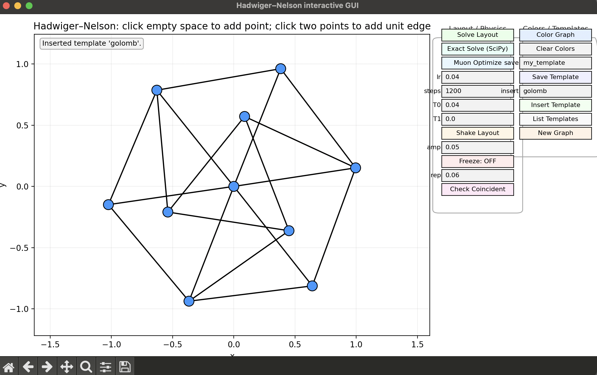

# interactive_hadwiger_nelson

This project allows the user to interactively play with the finite graph version of the Hadwiger-Nelson problem. Python GUI code is vibe-coded. 

# Structure

`hadwiger_nelson_gui.py` launches the app. \
`hn_user_guide.md` is a user guide. \
`hn_dev_guide.md` is a developer guide for contributors and future me. 

# Features

- Intuitive UI for building graphs (details in user guide)
- 'Freeze' mechanism to add multiple vertices and edges in one go before graph tries to resolve itself and move vertices around
- Scipy and [Muon](https://kellerjordan.github.io/posts/muon/) optimisers to resolve graphs into valid states
- 'Shake' mechanism with configurable amplitude to kick the graph out of local minima
- Saving and loading of graphs (enabling building large graphs from copies)
- Chromatic number solver of any arbitrary graph, including sample colouring

# Example

# Background

The Hadwiger Nelson problem ([Wikipedia](https://en.wikipedia.org/wiki/Hadwiger%E2%80%93Nelson_problem)) is an unsolved problem that asks "*What is the minimum number of colours required to colour every point in the plane such that no two points at distance 1 from each other have the same colour?*". The value is known to be one of 5, 6 or 7. 

The problem can be equivalently stated as: "*What is the maximal chromatic number of a graph whose edges all have length 1?*"

Well-connected graphs become cumbersome to draw by hand beyond a small number of vertices. It is difficult to verify whether a given graph is a valid unit distance graph. It is also difficult to calculate the chromatic number of a given graph. 

The desire to automate these 3 pains away, so that I can focus on quickly prototyping graphs to build intuition for the Hadwiger-Nelson problem, is what inspired this project.

# To-do

[ ] Vibe coding to replace matplotlib with plotly \
[ ] Fix GUI buttons and text \
[ ] Include graph theoretic operations like subdivision and smoothing (to glue subgraphs)